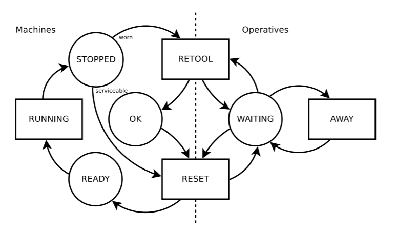

# Discrete Event Simulation

The complexity of many real-world systems involves unaffordable analytical models, and consequently, such systems are commonly studied by means of simulation. Different types of simulation apply depending on the nature of the system under consideration. In the last chapter we focused on static simulation, also called Monte Carlo simulation. In this chapter we discuss discrete-event simulation (DES) which is a specific technique for modelling stochastic, dynamic and discretely evolving systems. As opposed to continuous simulation, which typically uses smoothly-evolving equational models, DES is characterized by sudden state changes at precise points of (simulated) time.

Customers arriving at a bank, products being manipulated in a supply chain, or packets traversing a network are common examples of such systems. The discrete nature of a given system arises as soon as its behavior can be described in terms of events, which is the most fundamental concept in DES. An event is an instantaneous occurrence that may change the state of the system, while, between events, all the state variables remain constant.

To implement DES in R we will take advantage of the `simmer` package which provides capabilities to easily model a wide range of applications.

## The donut shop

You may recall that in Chapter 1 we discussed the example of a simple donut shop where we were interested in the waiting time of costumers depending on the number of employees in the shop. We will slowly build a more and more realistic implementation of the shop using `simmer`. First, if you have never  done this, you need to install the package using the code
```{r eval = F}
install.packages("simmer")
```
Once it is installed (that you only need to do once), you then need to load it at the beginning of every R session using the code
```{r warning = F, message = F}
library(simmer)
```

As we will see `simmer` takes advantage of the `magrittr` pipe operator.


### A single customer at a fixed time

We first model a single customer who arrives at the shop for a visit, looks around at the decor for a time and then leaves. There is no queueing. First we will assume his arrival time and the time he spends in the shop are fixed.

The arrival time is fixed at 5, and the time spent in the shop is fixed at 10. We interpret ‘5’ and ‘10’ as ‘5 minutes’ and ‘10 minutes’. The simulation runs for a maximum of 100 minutes, or until all the customers that are generated complete their visit to the shop.

Let's define step by step the code that implements this. First we define a variable called `customer` which describes the evolution of the customer in the shop. The evolution of the customer is called the `trajectory` and it is given some name. The function `log_` produces text which is shown as specific points during the simulation. Lastly, `timeout` specifies how long the customer will spend in the shop. 

```{r}
customer <-
  trajectory("Customer's path") %>%
  log_("Here I am") %>%
  timeout(10) %>%
  log_("I must leave")
```

Now that we have described how the customer behaves in the shop, we must create a variable specifying how the shop itself works. The code below creates the variable `shop` where first we create a `simmer` object called `shop` and then we specify via the function `add_generator` that a customer arrives after 5 minutes.

```{r}
shop <-
  simmer("shop") %>%
  add_generator("Customer", customer, at(5))
```

Now that the shop is created we have to run the simulation using the `run` command.
```{r}
shop %>% run(until = 100)
```
The output summarizes what happened during the simulation. A customer arrives at minute 5 and leaves at minute 15. The simulation then stops since there are no other events that can happen in this simple case.

In order to have an overview of the events of the simulation we can also use the function `get_mon_arrivals`.
```{r}
shop %>% get_mon_arrivals()
```

### A customer arriving at random

Now we extend the model to allow our customer to arrive at a random simulated time though we will keep the time in the bank at 10, as before.

The change occurs in the arguments to the `add_generator` function. We will assume that the customer arrival time is generated from an Exponential distribution with parameter 1/5 (that is mean = 5).

```{r}
set.seed(2021)

customer <-
  trajectory("Customer's path") %>%
  log_("Here I am") %>%
  timeout(10) %>%
  log_("I must leave")

shop <-
  simmer("shop") %>%
  add_generator("Customer", customer, at(rexp(1, 1/5)))

shop %>% run(until = 100)

shop %>% get_mon_arrivals()
```

The trace shows that the customer now arrives at time 5.925307. Changing the seed value would change that time.

### Many random customers

We now extend this model to allow multiple arrivals at random. In simulation this is usually interpreted as meaning that the times between customer arrivals are distributed as exponential random variables (we will see later on why this is so). There is little change in our program: we need to adapt the `add_generator` function. We will run the simulation a shorter time, since otherwise the output becomes massive.

```{r}
set.seed(2021)

customer <-
  trajectory("Customer's path") %>%
  log_("Here I am") %>%
  timeout(10) %>%
  log_("I must leave")

shop <-
  simmer("shop") %>%
  add_generator("Customer", customer, function() rexp(1, 1/5))

shop %>% run(until = 30)

shop %>% get_mon_arrivals()
```

So we see that in the 30 minutes we simulated, 10 customers arrived at the shop and 5 of them left after staying there for 10 minutes.

### The donut shop with a service counter

So far, the model has been more like an art gallery, the customers entering, looking around, and leaving. Now they are going to require service from an employee. We extend the model to include a service counter that will be modelled as a ‘resource’. The actions of a Resource are simple: a customer requests a unit of the resource (an employee). If one is free, then the customer gets service (and the unit is no longer available to other customers). If there is no free employee, then the customer joins the queue until it is the customer’s turn to be served. As each customer completes service and releases the unit, the employee can start serving the next in line.

The service counter is created with the `add_resource` function. Default arguments specify that it can serve one customer at a time, and has infinite queuing capacity.

The `seize` function causes the customer to join the queue at the counter. If the queue is empty and the counter is available (not serving any customers), then the customer claims the counter for itself and moves onto the `timeout` step. Otherwise the customer must wait until the counter becomes available. Behaviour of the customer while in the queue is controlled by the arguments of the `seize` function. Once the `timeout` step is complete, the `release` function causes the customer to make the counter available to other customers in the queue.

We will assume that serving time follows a Normal distribution with mean 10 and standard deviation 2.

```{r}
set.seed(2021)

customer <-
  trajectory("Customer's path") %>%
  log_("Here I am") %>%
  seize("counter") %>%
  timeout(function() rnorm(1,10,2)) %>%
  release("counter") %>%
  log_("Finished")

shop <-
  simmer("shop") %>%
  add_resource("counter") %>%
  add_generator("Customer", customer, function() rexp(1, 1/5))

shop %>% run(until = 30)
```

So we see that 4 customers arrived in the shop and that 2 of them were served. Let's use the function `get_mon_arrivals` to have a summary of each customer. By default, the function does not tell us the waiting time for a customer, which we will need to compute.

```{r}
shop %>%
  get_mon_arrivals() %>%
  transform(waiting_time = end_time - start_time - activity_time)
```

### Several service counters

Here we model a shop whose customers arrive randomly and are to be served at a group of counters, taking a random time for service, where we assume that waiting customers form a single first-in first-out queue.

The only difference between this model and the single-server model is in the `add_resource` function, where we have increased the capacity to two so that it can serve two customers at once.

```{r}
set.seed(2021)

customer <-
  trajectory("Customer's path") %>%
  log_("Here I am") %>%
  seize("counter") %>%
  timeout(function() rnorm(1,10,2)) %>%
  release("counter") %>%
  log_("Finished")

shop <-
  simmer("shop") %>%
  add_resource("counter",2) %>%
  add_generator("Customer", customer, function() rexp(1, 1/5))

shop %>% run(until = 30)

shop %>%
  get_mon_arrivals() %>%
  transform(waiting_time = end_time - start_time - activity_time)
```

Now that we also have a counter we can get some summary statistics from it using the function `get_mon_resources`.

```{r}
shop %>% get_mon_resources()
```

### Simple visualizations

We have learned to implement various simple simulations of our donut shop. The output we get is informative and comprehensive but nor particularly appealing to present, for instance in a report. The package `simmer.plot` provides plotting capabilities to summarize the results of a simulation. At this stage we will see two simple capabilities of the package. We will learn more about it in the following sections.
  
Before using `simmer.plot` you need to install it only once via
```{r eval = F}
install.packages("simmer.plot")
```
and then load it at the beginning of every R session where you plan to use it.

```{r message = F, warning = F}
library("simmer.plot")
```

First, we can plot how much a resource, in this case our two employees, is utilized using the following code.

```{r out.width="80%",fig.align='center'}
resources <- get_mon_resources(shop)
plot(resources, metric = "utilization")
```

So we see that our employees are busy around 90\% of the time. We can also see when they are busy as well as how many people are queuing at each moment during the simulation using the code below.
```{r out.width="80%",fig.align='center'}
plot(resources, metric = "usage",steps=T)
```

The green line reports the number of employees busy and we can see that most of the time they are both busy. The red line reports the number of people queuing and waiting to be served. The blue line is the total number of customers in the system: those queuing plus those being served.

## Replication 

For all previous examples, we ran a unique simulation and observed the results. As we have already learned, these results are affected by randomness and different runs will show different results. 

Consider the last simulation we implemented where customers arrive at the shop where we have two counters. We can simulate the system 1000 times using the following code. We will not include `log` since otherwise the output will become cluttered.

```{r}
customer <-
  trajectory("Customer's path") %>%
  seize("counter") %>%
  timeout(function() rnorm(1,10,2)) %>%
  release("counter") 


envs <- lapply(1:100, function(i) {
    simmer("shop") %>% 
    add_resource("counter",2) %>%
    add_generator("Customer", customer, function() rexp(1, 1/5)) %>%
    run(until=240)
}
)
```

Now `envs` stores the output of simulating the behavior of the shop for 4 hours 100 times.

We can summarize the results of these simulations using the `simmer.plot` package. 

```{r out.width="50%", fig.align='center'}
plot(get_mon_resources(envs), metric = "utilization")
```

Compared to previous plots we now notice that the output also has something that resembles a boxplot which tells us what was the utilization of the resource in different simulation runs.


We can also assess how busy were the employees in different simulations. As the shop opens the two employees become more and more busy and at the end of the four hours they are busy almost all the time.

```{r}
plot(get_mon_resources(envs), metric = "usage", items = "server")
```


Similarly, we can look at how long do customers queue in our shop. 
```{r}
plot(get_mon_arrivals(envs), metric = "waiting_time")
```

Each black line represents a single simulation and the blue line gives an overall representation of the simulation. We can see that the waiting time seems to be linearly increasing with time.

## The donut shop - advanced features

In many situations there is a system of priority service. Those customers with high priority are served first, those with low priority must wait. In some cases, preemptive priority will even allow a high-priority customer to interrupt the service of one with a lower priority.

`Simmer` implements priority requests with an extra integer priority argument to `add_generator()`. By default, priority is zero; higher integers have higher priority.


### Priority customers without preemption

Suppose the donut shop have priority customers that when arrive at the shop, are served as soon as possible. We make the assumption that they arrive 

```{r}
customer <-
  trajectory("Customer's path") %>%
  log_("Here I am") %>%
  seize("counter") %>%
  timeout(function() rnorm(1,10,2)) %>%
  release("counter") %>%
   log_("Finished")

shop <-
  simmer("shop") %>%
  add_resource("counter") %>%
  add_generator("Customer", customer, function() rexp(1, 1/5)) %>%
add_generator("Priority_Customer", customer, function() rexp(1, 1/15), priority = 1)

set.seed(2021)
shop %>% run(until = 45)
```

From the output we can see that whenever a priority customer joins the queue he is sold donuts as soon as the employee becomes available.


### Priority customers with preemption

Now we allow priority customers to have preemptive priority. They will displace any customer in service when they arrive. That customer will resume when they finish (unless higher priority customers intervene). This requires only a change to one line of the program, adding the argument, `preemptive = TRUE` to the `add_resource` function call.

```{r}
shop <-
  simmer("shop") %>%
  add_resource("counter", preemptive = TRUE) %>%
  add_generator("Customer", customer, function() rexp(1, 1/5)) %>%
add_generator("Priority_Customer", customer, function() rexp(1, 1/15), priority = 1)

set.seed(2021)
shop %>% run(until = 45)
```

In this other case, priority customers are served straight away. The customer that was served when the priority customer arrived resumes is service as soon as the priority customer finishes.


### Balking customers

Balking occurs when a customer refuses to join a queue if it is too long. Suppose that if there is one customer queuing in our shop then customers do not join the queue and leave. We can implement this by setting the `queue_size` option of `add_resource` and by adding some options of the `seize` function. Let's consider the following code.

```{r}
customer <-
  trajectory("Customer's path") %>%
  log_("Here I am") %>%
  seize("counter", continue = FALSE, reject = 
          trajectory("Balked customer") %>% log_("Balking") ) %>%
  timeout(function() rnorm(1,10,2)) %>%
  release("counter") %>%
   log_("Finished")

shop <-
  simmer("shop") %>%
  add_resource("counter", queue_size = 1) %>%
  add_generator("Customer", customer,
                function() rexp(1, 1/5))
```

The input `queue_size` is self-explanatory and simply sets how many people can queue for the counter. In the `seize` function we set the inputs `continue` and `reject`. With `continue = FALSE` we are saying that a rejected customer does not follow the rest of the trajectory. With `reject` we are specifying what trajectory the rejected customer will follow.

Let's run the simulation.
```{r}
set.seed(2021)
shop %>% run(until = 45)
```

So now we see that often customers just leave the shop because they decide not to queue. We can count how many of them left for balking using:

```{r}
sum(get_mon_arrivals(shop)$activity_time == 0)
```

and the hourly rate at which they leave
```{r}
sum(get_mon_arrivals(shop)$activity_time == 0)/now(shop)*60
```

### Reneging (or abandoning) customers

Often in practice an impatient customer will leave the queue before being served. Simmer can model this reneging behaviour using the `renege_in()` function in a trajectory. This defines the maximum time that a customer will wait before reneging, as well as an ‘out’ trajectory for them to follow when they renege.

If the customer reaches the server before reneging, then their impatience must be cancelled with the `renege_abort()` function.

```{r}
customer <-
  trajectory("Customer's path") %>%
  log_("Here I am") %>%
  renege_in(function() rnorm(1,5,1),
            out = trajectory("Reneging customer") %>%
              log_("I am off")) %>%
  seize("counter") %>%
  renege_abort() %>%
  timeout(function() rnorm(1,10,2)) %>%
  release("counter") %>%
   log_("Finished")

shop <-
  simmer("shop") %>%
  add_resource("counter") %>%
  add_generator("Customer", customer, function() rexp(1, 1/5))

run(shop, until = 45)
```

### Several counters with individual queues

Each counter is now assumed to have its own queue. The programming is more complicated because the customer has to decide which queue to join. The obvious technique is to make each counter a separate resource.

In practice, a customer might join the shortest queue. We implement this behaviour by first selecting the shortest queue, using the `select` function. Then we use `seize_selected` to enter the chosen queue, and later `release_selected`.

The rest of the program is the same as before.

```{r}
set.seed(2021)
customer <-
  trajectory("Customer's path") %>%
  log_("Here I am") %>%
  select(c("counter1", "counter2"), policy = "shortest-queue") %>%
  seize_selected() %>%
  timeout(function() rnorm(1,10,2)) %>%
  release_selected() %>%
   log_("Finished")

shop <-
  simmer("shop") %>%
  add_resource("counter1", 1) %>%
  add_resource("counter2", 1) %>%
  add_generator("Customer", customer, function() rexp(1, 1/5))

run(shop, until = 45)
```

There are several policies implemented internally
that can be accessed by name:

  - `shortest-queue`: The resource with the shortest queue is selected.
  
  - `round-robin`: Resources will be selected in a cyclical nature.
  
  - `first-available`: The first available resource is selected.
  
  - `random` A resource is randomly selected.

### Opening times

Customers arrive at random, some of them getting to the shop before the door is opened by a doorman. They wait for the door to be opened and then rush in and queue to be served.

This model defines the door as a resource, just like the counter. The capacity of the door is defined according to the `schedule` function, so that it has zero capacity when it is shut, and infinite capacity when it is open. Customers ‘seize’ the door and must then wait until it has capacity to ‘serve’ them. Once it is available, all waiting customers are ‘served’ immediately (i.e. they pass through the door). There is no timeout between ‘seizing’ and ‘releasing’ the door.

```{r}
customer <-
  trajectory("Customer's path") %>%
  log_(function()
    if (get_capacity(shop, "door") == 0)
      "Here I am but the door is shut."
    else "Here I am and the door is open."
  ) %>%
  seize("door") %>%
  log_("I can go in!") %>%
  release("door") %>%
  seize("counter") %>%
  timeout(function() {rexp(1, 10)}) %>%
  release("counter")

door_schedule <- schedule(c(1,7,9,13), c(Inf,0,Inf,0), period = 13)

shop <-
  simmer("shop") %>%
  add_resource("door", capacity = door_schedule) %>%
  add_resource("counter") %>%
  add_generator("Customer", customer, function() rexp(1, 1))

shop %>% run(26)
```

### Batching clients

Customers arrive at random, some of them getting to the shop before the door is open. This is controlled by an automatic machine called the doorman which opens the door only at intervals of 30 minutes (it is a very secure shop). The customers wait for the door to be opened and all those waiting enter and proceed to the counter. The door is closed behind them.

One possible solution is using batching. Customers can be collected into batches of a given size, or for a given time, or whichever occurs first. Here, they are collected for periods of 30, and the number of customers in each batch is unrestricted.

After the batch is created with `batch` it is then separated with `separate`. 

```{r}
set.seed(2021)
customer <-
  trajectory("Customer's path") %>%
  log_("Here I am, but the door is shut.") %>%
  batch(n = Inf, timeout = 30) %>%
  separate() %>%
  log_("The door is open!") %>%
  seize("counter") %>%
  timeout(function() {rexp(1, 1/2)}) %>%
  release("counter") %>%
  log_("Finished.")

shop <- simmer("shop")
shop %>%
  add_resource("door") %>%
  add_resource("counter") %>%
  add_generator("Customer",
                customer, function() rexp(1, 1/20)) 

shop %>% run(65)
```

The function `balk` takes two inputs: 

   - `n`: the batch size;
   
   - `timeout`: set an optional timer which triggers batches every `timeout` time units even if the batch size has not been fulfilled.
   

## Simulating a simple health center

Let’s say we want to simulate an ambulatory consultation where a patient is first seen by a nurse for an intake, next by two doctors for the consultation and finally by administrative staff to schedule a follow-up appointment.

We can construct a patient trajectory which defines all these steps.

```{r}
patient <- trajectory("patients' path") %>%
  ## add an intake activity 
  seize("nurse", 1) %>%
  timeout(function() rnorm(1, 15)) %>%
  release("nurse", 1) %>%
  ## add a consultation activity
  seize("doctor", 2) %>%
  timeout(function() rnorm(1, 20)) %>%
  release("doctor", 2) %>%
  ## add a planning activity
  seize("administration", 1) %>%
  timeout(function() rnorm(1, 5)) %>%
  release("administration", 1)
```

```{r}
plot(patient)
```

Once the trajectory is known, you may attach arrivals to it and define the resources needed. In the example below, three types of resources are added: the nurse and administration resources, each one with a capacity of 2, and the doctor resource, with a capacity of 4. The last method adds a generator of arrivals (patients) following the trajectory patient. The time between patients is about 5 minutes.

Let's run the simulation using replication.
```{r}
envs <- lapply(1:100, function(i) {
simmer("health center") %>%
  add_resource("nurse", 3) %>%
  add_resource("doctor", 4) %>%
  add_resource("administration", 2) %>%
  add_generator("patient", patient, function() rexp(1, 1/5)) %>%
    run(until=480)
}
)
```

Let's observe the results.
```{r}
plot(get_mon_resources(envs),metric= "utilization")
```


```{r}
plot(get_mon_resources(envs), metric = "usage", items = "server")
```

```{r}
plot(get_mon_arrivals(envs), metric = "waiting_time")
```


## A production process simulation

Consider a simple engineering job shop that consists of several identical machines. Each machine is able to process any job and there is a ready supply of jobs with no prospect of any shortages. Jobs are allocated to the first available machine. The time taken to complete a job is variable but is independent of the particular machine being used. The machine shop is staffed by operatives who have two tasks:

 - RESET machines between jobs if the cutting edges are still OK
 
 - RETOOL those machines with cutting edges that are too worn to be reset
 
In addition, an operator may be AWAY while attending to personal needs

The figure below shows the activity cycle diagram for the considered system. Circles (READY, STOPPED, OK, WAITING) represent states of the machines or the operatives respectively, while rectangles (RUNNING, RETOOL, RESET, AWAY) represent activities that take some (random) time to complete. Two kind of processes can be identified: shop jobs, which use machines and degrade them, and personal tasks, which take operatives AWAY for some time.

```{r, echo=FALSE, out.width="50%", fig.align="center"}

```

Notice that after a job is completed by a machine there may be two possible trajectories to follow:

 - either the machine needs only to be reset by an operator;
 
 - or it first needs to be retool and then reset by the operator.
 
We can implement such a situation using `branch`. A branch is a point in a trajectory in which one or more sub-trajectories may be followed. The `branch()` activity places the arrival in one of the sub-trajectories depending on some condition evaluated in a dynamical parameter called `option`. It is the equivalent of an if/else in programming, i.e., if the value of `option` is `i`, the i-th sub-trajectory will be executed.

Let's implement the system. First of all, let us instantiate a new simulation environment and define the completion time for the different activities as random draws from exponential distributions. Likewise, the interarrival times for jobs and tasks are defined (`NEW_JOB`, `NEW_TASK`), and we consider a probability of 0.2 for a machine to be worn after running a job (`CHECK_JOB`).

```{r}
set.seed(2021)
env <- simmer("Job Shop")

RUNNING <- function() rexp(1, 1)
RETOOL <- function() rexp(1, 2)
RESET <- function() rexp(1, 3)
AWAY <- function() rexp(1, 1)
CHECK_WORN <- function() runif(1) < 0.2
NEW_JOB <- function() rexp(1, 5)
NEW_TASK <- function() rexp(1, 1)
```

The trajectory of an incoming job starts by seizing a machine in `READY` state. It takes some random time for `RUNNING` it after which the machine’s serviceability is checked. An operative and some random time to `RETOOL` the machine may be needed, and either way an operative must `RESET` it. Finally, the trajectory releases the machine, so that it is `READY` again. On the other hand, personal tasks just seize operatives for some time.

```{r}
task <- trajectory() %>%
  seize("operative") %>%
  timeout(AWAY) %>%
  release("operative")

job <- trajectory() %>%
  seize("machine") %>%
  timeout(RUNNING) %>%
  branch(
   CHECK_WORN, continue = TRUE,
   trajectory() %>%
   seize("operative") %>%
   timeout(RETOOL) %>%
   release("operative")) %>%
  seize("operative") %>%
  timeout(RESET) %>%
  release("operative") %>%
  release("machine")
```

Once the processes’ trajectories are defined, we append 10 identical machines and 5 operatives
to the simulation environment, as well as two generators for jobs and tasks.

```{r}
env %>%
  add_resource("machine", 10) %>%
  add_resource("operative", 5) %>%
  add_generator("job", job, NEW_JOB) %>%
  add_generator("task", task, NEW_TASK) %>%
  run(until=10)
```

Let's extract a history of the resource’s state to analyze the average number of machines/operatives in use as well as the average number of jobs/tasks waiting for an assignment.

```{r}
aggregate(cbind(server, queue) ~ resource, get_mon_resources(env), mean)

```

```{r}
plot(get_mon_resources(env),"utilization")
plot(get_mon_resources(env),"usage", items = "server")
```


