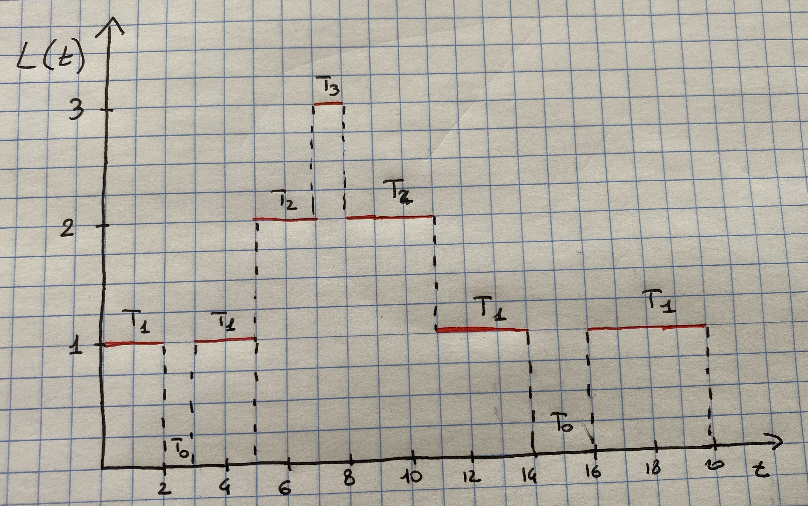
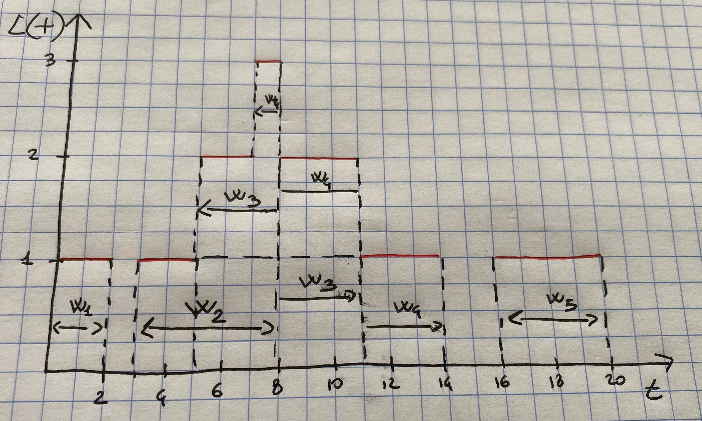
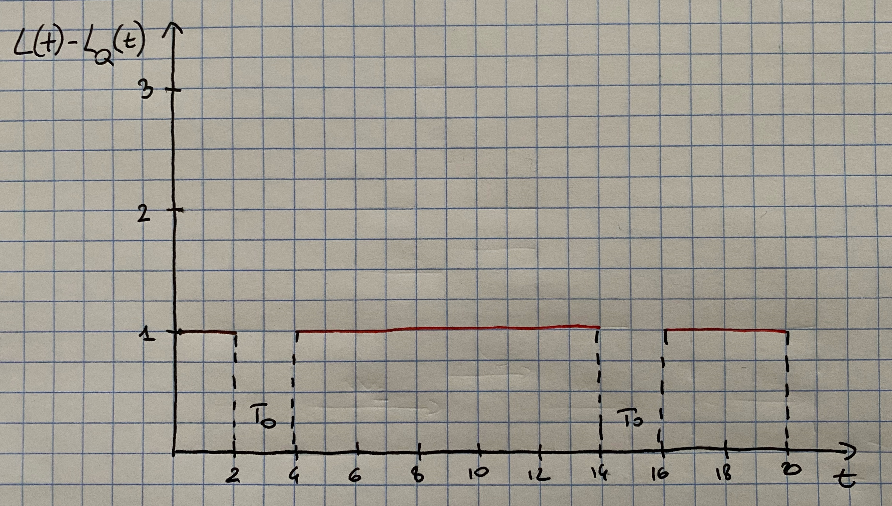
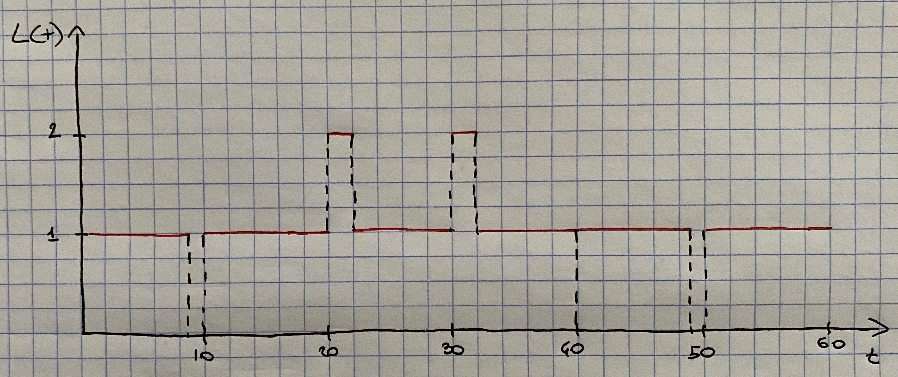

# Queuing Theory

In the previous chapter we have learned to implement complex discrete-event simulations using the `Simmer` package. Basically all simulation models we implemented involved some queue of customers requiring a service. There is a whole area of probability called, *queuing theory*, which studies the mathematical foundations and properties of such models. In this chapter we will define a bit more formally what queues are and how they work. We will also learn that we can actually already know a lot about the behavior of the queue by knowing a few key parameters.

## Poisson Process

Consider random events such as the arrival of customer at a shop, the arrival of emails to a mail server or the arrival of calls to a call-center. These events can be described by a counting function $N(t)$ defined for all $t\geq 0$. This counting function represents the number of events that occurred in $[0,t]$. For each interval $[0,t]$ the value $N(t)$ is an observation of a random variable where the only possible values are the integers $0,1,2,\dots$.

The counting process $\{N(t): t\geq 0\}$ is said to be a Poisson process with mean rate $\lambda$ if the following assumptions are fulfilled:

  - $N(0) = 0$;
  
  - it has independent increments: that is the number of arrivals during non-overlapping time intervals are independent random variables.
  
  - the number of events in any interval of length $t$ is a Poisson random variable with parameter $\lambda t$.
  
Therefore 
\[
P(N(t)=n)=\frac{e^{-\lambda t}(\lambda t)^n}{n!}
\]

The last assumption implies that the distribution of the number of arrivals between, say, $t$ and $t+s$ depends only on the length of the interval $s$ and not on the starting point $t$. This property is usually called *stationarity*. Consequently:

\[
P(N(t)-N(s)=n)=\frac{e^{-\lambda(t-s)}(\lambda(t-s))^n}{n!}
\]
and because of the properties of the Poisson distribution:
\[
E(N(t)-N(s))=V(N(t)-N(s))=\lambda(t-s).
\]

Now consider the time at which arrivals occurs in a Poisson process. Let the first arrival occur at time $A_1$, the second occur at time $A_1+ A_2$ and so on. Thus $A_1,A_2,\dots$ are successive inter-arrival times. The first arrival occurs after time $t$ if and only if there are no arrivals in the interval $[0,t]$ so it is seen that 
\[
\{A_1>t\}=\{N(t)=0\}
\]
and consequently
\[
P(A_1>t)=P(N(t)=0)=e^{-\lambda t}
\]
Thus the probability that the first arrival will occur in $[0,t]$ is given by
\[
P(A_1\leq t)= 1- P(A_1>t)= 1- e^{-\lambda t}
\]
which is the cumulative density function of an exponential distribution with parameter $\lambda$. Hence, $A_1$ is distributed exponentially with mean $E(A_1)=1/\lambda$. It can also be shown that all inter-arrival times $A_1,A_2,\dots$ are exponentially distributed and independent with mean $1/\lambda$.

An alternative definition of a Poisson process is of a counting process whose inter-arrival times are distributed exponentially and independently.

Exponential distributions have the property of being *memoryless*, which is deeply connected to Poisson processes. For an exponential distribution $X$ it holds that
\[
P(X> s+t|X>s)=P(X>t).
\]
Suppose $X$ represents the life of a light bulb. The above equation states that the probability that the light bulb lives for at least $s+t$ hours, given it has survived $s$ hours, is that same as the initial probability that it lives for at least $t$ hours. That is, the light bulb it does not remember that it has already been in use for a time $s$. Let's show the equality is true:
\begin{eqnarray*}
P(X>s+t | X>s) &=& \frac{P(X > s + t, X >s)}{P(X>s)}\\
&=& \frac{P(X > s + t)}{P(X>s)}\\
&=&\frac{1- P(X \leq s + t)}{1 - P(X \leq s)}\\
&=&\frac{e^{-\lambda(s+t)}}{e^{-\lambda s}}\\
&=& e^{-\lambda t}\\
&=& P(X>t)
\end{eqnarray*}

## Characteristics of Queuing Systems

The key elements of queuing systems are customers and servers. 

 - The term *customer* can refer to people, machines, trucks, airplanes etc etc. Anything that arrive at a facility and requires service. 
 
 - The term *server* can refer to receptionist, repair personnel, runways in airport, washing machines etc etc. Any resource that provides the requested service. 

Below we describe the elements of queuing systems in more details.

### The Calling Population

The population of potential customers, referred to as the *calling population*, will be assumed to be infinite, even though the number of potential customers is actually finite. When the population of potential customers is large this assumption is innocuous and actually can simplify the model. This is especially true when we believe that at any given time the number of customers being served or waiting for service is a small proportion of the whole population.

The assumption of an infinite population is such that the rate of arrival of customers is not affected by the number of customers that have already joined the queuing system. In addition, this will usually entail that the rate of arrival is constant throughout time.

### System Capacity

In many queuing systems there is a limit to the number of customers that may be in the waiting line or system. An arriving customer who finds the system full does not enter but returns immediately to the calling population. However, there are other systems that may simply have an infinite capacity. As we will see later, when a system has a limited capacity, a distinction is made between the arrival rate (i.e. the number of arrivals per time unit) and the effective arrival rate (the number who arrive and enter the system per time unit).

### The Arrival Process

The arrival process for infinite population models is usually characterized in terms of inter-arrival times of successive customers. Arrivals may occur at scheduled times or random times. When at random times, the inter-arrival times are usually characterized by a probability distribution. In addition, customers may arrive one at a time or in batches. The batch may be of constant size or of random size. 

The most important model, and the only one we will consider, for random arrivals is the Poisson arrival process. If $A_n$ represents the inter-arrival time between customer $n-1$ and customer $n$, then for a Poisson arrival process $A_n$ is exponentially distributed with mean $1/\lambda$ per time unite. The arrival rate is $\lambda$ customers per time unit. The number of arrivals in a time interval of length $t$ has the Poisson distribution with mean $\lambda t$ customers.

### Queue Behavior and Queue Discipline

Queue behavior refers to the actions of customers while in a queue waiting for service to begin. In some situation, there is a possibility that incoming customers will balk, renege, or jockey (move from one line to another if they think they have chosen a slow line).

Queue discipline refers to the logical ordering of customers in a queue and determines which customer will be chosen for service when a server becomes free. Common queue disciplines include first-in-first-out (FIFO), last-in-first-out (LIFO), service in random order (SIRO) etc. Notice that a FIFO queue discipline implies that services begin in the same order as arrivals, but that customers could leave the system in a different order because of different length service times.

### Service Times and Service Mechanism

The service times of successive arrivals are denoted by $S_1,S_2,\dots$. They may be constant or of random duration. In the latter case $\{S_1,S_2,S_3,...\}$ is usually characterized as a sequence of independent and identically distributed random variables. The Exponential, Normal etc. are often used to model service times. Sometimes services are identically distributed for all customers of a given type or class or priority, whereas customers of different types might have completely different service-time distributions. In addition in some systems service times depend upon the time of the day or upon the length of the waiting line.

A queuing system consists of a number of service counters and interconnecting queues. Each service center consists of some number of server, $c$, working in parallel; that is, upon getting to the head of the line, a customer takes the first available server. Parallel service mechanisms are either single server ($c=1$), multiple server ($1<c<\infty$), or unlimited servers $(c=\infty)$.

## Queuing Notation

Recognizing the diversity of queuing systems, a notational system was introduced in the 50's which has been widely adopted. The convention is based on the format $A/B/c/N/K$, where the letters represent the following system characteristics:

 - $A$ represents the inter-arrival time distribution
 
 - $B$ represents the service-time distribution
 
 - $c$ represents the number of parallel servers
 
 - $N$ represents the system capacity
 
 - $K$ represents the size of the calling population
 
Common symbols for $A$ and $B$ are include $M$ (exponential or Markov), $D$ (constant or deterministic) and $G$ (arbitrary or general). 

For example, $M/M/1/\infty/\infty$ indicates a single-server system that has unlimited queue capacity and infinite population of potential arrivals. The inter-arrival times and service times are exponentially distributed. When $N$ and $K$ are infinity, they may be dropped from the notation. For example $M/M/1/\infty/\infty$ is often shorted to $M/M/1$. 

All systems will be assumed to have a FIFO queue discipline.

## Measures of Performance

There are various measures that one can use to assess the quality of a queuing system. These are:

 - $L$: the average number of customers in the system;
 
 - $L_Q$: the average number of customers in the system;
 
 - $w$: the average time spent in the system;
 
 - $w_Q$: the average time spent in the queue;
 
 - $\rho$: the server utilization; the proportion of time that a server is busy.
 
The term system refers to the waiting line plus the service mechanism, whilst the term queue refers to the waiting line alone.

### Average Number of Customers in the System $L$

Consider a queuing system over a period of time $T$ and let $L(t)$ denote the number of customers in the system at time $t$. Let $T_i$ be the total time in $[0,T]$ in which the system contained exactly $i$ customers. In general $\sum_{i=0}^{\infty}T_i = T$. The *average number of customers in the system* is estimated by 
\[
\hat{L}=\frac{1}{T}\sum_{i=0}^\infty iT_i=\sum_{i=0}^\infty i \frac{T_i}{T}.
\]
Notice that $T_i/T$ is the proportion of time the system contains exactly $i$ customers.

Let's consider an example. Figure \@ref(fig:system) gives a simulation of a queue in an interval of 20 time units. It can be seen that $T_0= 3$, $T_1 = 11$, $T_2 = 5$ and $T_3 =1$, and therefore $\hat{L}= (0\cdot 3 + 1\cdot 11 + 2\cdot 5 + 3\cdot 1)/20 = 24/20 = 1.2$ customers.


```{r system, echo = F, fig.cap="Number in system, L(t), at time t.", out.width = "90%", fig.align='center'}

```

By looking at Figure \@ref(fig:system) it can be seen that the total area under the function $L(t)$ can be decomposed into rectangles of length $T_i$ and height $i$, thus having area $iT_i$. It follows that the total area is given by \[
\sum_{i=0}^{\infty}iT_i = \int_0^TL(t)dt
\]
and therefore
\[
\hat{L}= \frac{1}{T}\sum_{i=0}^{\infty}iT_i=\frac{1}{T}\int_{0}^TL(t)dt
\]

Many queuing systems exhibit some kind of long-run stability in terms of their average performance. For such systems, as time $T$ gets large, the observed average number of customers in the system $\hat{L}$ approaches a limiting value, say $L$, which is called the *long-run average number in system*. With probability 1 we have that
\[
\hat{L}=\frac{1}{T}\int_{0}^TL(t)dt \rightarrow L \mbox{ as } T \rightarrow \infty
\]
If a simulation run length $T$ is sufficiently long, the estimator $\hat{L}$ becomes arbitrarily close to $L$.

The above equations can be applied to any subsystem of a queuing system. If $L_Q(t)$ denotes the number of customers waiting in queue, and $T_i^Q$ denotes the total time in $[0,T]$ in which exactly $i$ customers are waiting in queue, then 
\[
\hat{L}_Q=\frac{1}{T}\sum_{i=0}^{\infty}iT_i^Q=\int_0^TL_Q(t)dt \rightarrow L_Q \mbox{ as } T \rightarrow \infty
\]

### Average Time Spent in System per Customer $w$

If we simulate a queuing system for some period of time, say $T$, then we can record the time that each customer spends in the system during $[0,T]$, say $W_1,W_2,\dots,W_N$ where $N$ is the number of arrivals in $[0,T]$. The average time spent in system per customer, called the *average system time*, is given by
\[
\hat{w} = \frac{1}{N}\sum_{i=1}^N W_i
\]
For stable systems, as $N\rightarrow \infty$
\[
\hat{w} \rightarrow w
\]
with probability 1, where $w$ is called the *long-run average system time*.

If the system under consideration is the queue alone, we can re-write the above equations as
\[
\hat{w}_Q=\frac{1}{N}\sum_{i=1}^NW_i^Q \rightarrow w_Q \mbox{ as } N \rightarrow \infty
\]
where $W_i^Q$ is the total time customer $i$ spends waiting in queue, $\hat{w}_Q$ is the observed average time spend in queue (or delay) and $w_Q$ is the long-run average delay per customer.

Consider the system in Figure \@ref(fig:system). It can be seen that there are 5 customers who waited $W_1 =2$, $W_2 = 5$, $W_3 = 6$, $W_4 = 7$ and $W_5 = 4$ and therefore
\[
\hat{w}=\frac{2+5 +6 + 7 + 4}{5}= 4.8 \mbox{ time units}
\]
Thus on average these customers spent 4.8 time units in the system. As for the time spent in the queue, it can be computed as $W_1^Q=0$, $W_2^Q = 0$, $W_3^Q=3$, $W_4^Q = 4$ and $W_5^Q = 0$, thus:
\[
\hat{w}_Q=\frac{0 + 0 + 3 + 4 +0}{5}= 1.4 \mbox{ time units.}
\]

### Little's Law

For the example in Figure \@ref(fig:system) there were $N=5$ arrivals in $T=20$ time units, and thus the observed arrival rate was $\hat{\lambda}= N/T=1/4$ customer per time unit. Recall that $\hat{L}=1.2$ and $\hat{w}=4.8$. Hence it follows that 
\[
\hat{L}=\hat{\lambda}\hat{w},
\]
since $1.2 = \frac{1}{4}4.8$.

This relationship is not coincidental: it holds for almost all queuing systems. Allowing $T\rightarrow \infty$ and $N\rightarrow \infty$, the above expression becomes
\[
L=\lambda w,
\]
where $\hat{\lambda}\rightarrow \lambda$ and $\lambda$ is the long-run average arrival rate. This equality is usually called *Little's law*. It says that the average number of customers in the system is equal to the average number of arrivals per time unit times the average time spent in the system. For Figure \@ref(fig:system) there is one arrival every 4 minutes (on average) and each arrival spends 4.6 minutes in the system (on average), so at an arbitrary point in time there will be $(1/4)(4.9)=1.2$ customers present (on average).

```{r system2, echo = F, fig.cap="System times Wi for the example system.", out.width = "90%", fig.align='center'}

```

Little's law can also be derived reconsidering Figure \@ref(fig:system) as follows. Figure \@ref(fig:system2) shows the exact same system history, but reporting the waiting time of each customer in the system, $W_i$. Again we can see that the area under the function $L(t)$ can be decomposed into rectangles of height 1 and length $W_i$, for each $i=1,2,\dots,N$. Therefore
\[
\sum_{i=1}^NW_i=\int_{0}^TL(t)dt
\]
Therefore, by using that $\hat{\lambda}=N/T$ we have that
\[
\hat{L}=\frac{1}{T}\int_{0}^TL(t)dt=\frac{1}{T}\sum_{i=1}^NW_i=\frac{N}{T}\frac{1}{N}\sum_{i=1}^NW_i=\hat\lambda\hat{w},
\]
which is indeed Little's law!

### Server Utilization

Server utilization is defined as the proportion of time that a server is busy. Observed served utilization, denoted by $\hat{\rho}$, is defined over a specified time interval $[0,T]$. Long-run server utilization is denoted by $\rho$. For systems that exhibit long-run stability,
\[
\hat{\rho}\rightarrow \rho \mbox{ as } T\rightarrow \infty
\]

#### Server Utilization in G/G/1 Queues

Consider any single-server queuing system with average arrival rate $\lambda$ customers per time unit, average service time $E(S)=1/\mu$ time units, and infinite queue capacity and calling population. Notice that $E(S)=1/\mu$ implies that when busy the server is working at the rate $\mu$ customers per time unit, on average: $\mu$ is called the *service rate*. 

Notice that the server alone is a subsystem that can be considered as a queuing system itself. hence, Little's law $L=\lambda w$ can be applied to the server. For stable systems, the average arrival rate to the server, say $\lambda_s$ must be identical to the average arrival rate to the system $\lambda$ (certainly $\lambda_s\leq \lambda$ since customers cannot be served faster than they arrive, but if $\lambda_s<\lambda$ the the waiting line would tend to grow in length and so we would have an unstable system). For the server subsystem, the average system time is $w=E(S)=1/\mu$. The actual number of customers in the server subsystem is either zero or one as shown in Figure \@ref(fig:system3) for the system in Figure \@ref(fig:system). Hence the average number in the server subsystem $\hat{L}_s$ is given by
\[
\hat{L}_s = \frac{T-T_0}{T}
\]
In the example $\hat{L}_s=17/20=\hat{\rho}$. 

```{r system3, echo = F, fig.cap="Number of customers being served at time t", out.width = "90%", fig.align='center'}

```


In general, for a single-server queue, the average number of customers being served at an arbitrary point in time is equal to server utilization. As $T\rightarrow \infty$, $\hat{L}_s=\hat{\rho}\rightarrow L_s=\rho$. Combining these results into $L=\lambda w$ for the server subsystem yields
\[
\rho = \lambda E(S)=\frac{\lambda}{\mu}
\]
that is the long-run server utilization in a single-server queue is equal to the average arrival rate divided by the average service rate. For a single-server queue to be stable, the arrival-rate $\lambda$ must be less then the service rate $\mu$:
\[
\lambda < \mu
\]
or
\[
\rho =\frac{\lambda}{\mu} < 1
\]
If the arrival rate is greater than the service rate $(\lambda > \mu)$ the server will eventually get further and further behind. After time, the server will always be busy, and the waiting line will tend to grow in length. For stable single-server systems long-run measures of performance such as average queue length $L_Q$ are well defined and have a meaning. For unstable systems long-run server utilization is 1 and the long-run average queue length is infinite.

#### Server Utilization in G/G/c Queues

Consider now a queuing system with $c$ identical servers in parallel. If an arriving customer finds more than one server idle, the customer chooses a server without favoring any particular server. Arrivals occur at rate $\lambda$ from an infinite calling population and each server works at rate $\mu$ customers per time unit.

Using a similar argument as above, one can derive that long-run average server utilization is defined by
\[
\rho = \frac{\lambda}{c\mu}
\]
and the system is stable if $\rho < 1$ or equivalently if
\[
\lambda < c\mu.
\]
The average number of busy servers is
\[
L_s=\frac{\lambda}{\mu}.
\]

#### An Example

Consider a doctor who schedules patients every 10 minutes and who spends $S_i$ minutes with the i-th patient, where
\[
S_i = \left\{
\begin{array}{l}
9 \mbox{ minutes with probability } 0.9\\
12 \mbox{ minutes with probability } 0.1
\end{array}
\right.
\]
Thus, arrivals are deterministic (every 10 minutes) but services are stochastic with mean and variance given by
\[
E(S_i)= 9\cdot 0.9 + 12\cdot 0.1 = 9.3 \mbox{ minutes}
\]
and
\[
V(S_i)=0.9\cdot(9-9.3)^2 + 0.1\cdot(12-9.3)^2 = 0.81 \mbox{ minutes}^2
\]
Here $\rho=\lambda /\mu = 9.3/10=0.93 < 1$ and so the system is stable and the doctor will be busy 93\% of the time in the long-run. In the short-run, sometimes queues will build up temporarily because of the variability of the service distribution, as shown in Figure \@ref(fig:system4).

```{r system4, echo = F, fig.cap="Number of patients in the doctor's office at time t", out.width = "90%", fig.align='center'}

```


## Steady-State Behavior of the M/M/1 Model

Henceforth, we assume that the calling population is infinite, the arrivals are assumed to follow a Poisson process with rate $\lambda$ arrivals per time unit - that is, the inter-arrival times are assumed to be exponentially distributed with mean $1/\lambda$. We also assume that service times are exponentially distributed with mean $1/\mu$. The queue discipline will be FIFO. Because of the exponential distribution assumption on the arrival process, these models are called *Markovian*.

A queuing system is said to be in *statistical equilibrium* or in *steady state* if the probability that the system is in a given state is not time-dependent: that is
\[
P(L(t)=n)= P_n(t) = P_n
\]
is independent of time $t$. Two properties of such systems:

 - they approach statistical equilibrium from any starting state,
 
  - they remain in statistical equilibrium once it is reached.
  
For the models that we will consider next the steady-state parameter $L$, the average number of customers in the system, can be computed as
\[
L= \sum_{n=0}^\infty nP_n
\]
where $\{P_0,P_1,\dots\}$ are the steady-state probabilities of finding $n$ customers in the system. Once $L$ is given, the other steady-state parameters can be computed easily from Little's law:
\begin{align*}
w &= \frac{L}{\lambda}\\
w_Q &= w - \frac{1}{\mu}\\
L_Q &= \lambda w_Q, 
\end{align*}
where $\lambda$ is the arrival rate and $\mu$ is the service rate.

Recall that for queues to reach statistical equilibrium a necessary and sufficient condition is that $\lambda/c\mu <1 $.

For the M/M/1 model the steady-state parameters can be shown to be equal to:
\begin{align*}
\rho &= \frac{\lambda}{\mu} \\
L &= \frac{\lambda}{\mu-\lambda}\\
w &= \frac{1}{\mu-\lambda}\\
w_Q &= \frac{\lambda}{\mu(\mu-\lambda)}\\
L_Q &= \frac{\lambda^2}{\mu(\mu-\lambda)}\\
P_n &= \left(1-\frac{\lambda}{\mu}\right)\left(\frac{\lambda}{\mu}\right)^n
\end{align*}


Let's consider an example. Suppose that the interarrival times and service times of a single-chair unisex hair-styling shop have been shown to be exponentially distributed. The values of $\lambda$ and $\mu$ are 2 per hour and 3 per hour, respectively: that is, the time between arrivals averages 1/2 hour and the service time averages 20 minutes. The server utilization and the probabilities for 0, 1, 2, 3, and 4 or more customers in the shop are computed as follows:
\begin{align*}
\rho &= \frac{\lambda}{\mu}=2/3\\
P_0 &= 1- \frac{\lambda}{\mu} = 1/3\\
P_1 &= \left(\frac{1}{3}\right) \left(\frac{2}{3}\right) =\frac{2}{9}\\
P_2 &= \left(\frac{1}{3}\right) \left(\frac{2}{3}\right)^2 =\frac{4}{27}\\
P_3 &= \left(\frac{1}{3}\right) \left(\frac{2}{3}\right)^3 =\frac{8}{81}\\
P_{\geq 4}&= 1-\sum_{n=0}^3=\frac{16}{81}
\end{align*}
From the above calculations the probability that the hair stylist is busy is $1-P_0=0.67$ and thus the probability that he is free is $0.33$. The average number of customer in the system is 
\[
L=\frac{\lambda}{\mu-\lambda}=\frac{2}{3-2}= 2 \mbox{ customers}
\]
The average time in the system is
\[
w = \frac{L}{\lambda}=\frac{1}{\mu-\lambda} = \frac{2}{2}=1 \mbox{ hour}
\]
The average time the customer spends in the queue is 
\[
w_Q = w - \frac{1}{\mu}= 1- \frac{1}{3}= \frac{2}{3} \mbox{ hour}
\]
and the number of customer in the queue is
\[
L_Q = \frac{\lambda^2}{\mu(\mu-\lambda)}=\frac{4}{3} \mbox{ customers}
\]

Let's consider another example. Arrivals occur at rate $\lambda = 10$ per hour and management has a choice of two servers, one who works at rate $\mu_1=11$ customers per hour and the second at rate $\mu_2 = 12$ customers per hour. The utilizations are $\rho_1 = 10/11=0.909$ and $\rho_2 = 10/12 = 0.833$. Assume a M/M/1 model, then
\[
L_1 = \frac{\lambda}{\mu_1-\lambda}=\frac{10}{11-10}=10
\]
whilst
\[
L_2 = \frac{\lambda}{\mu_2-\lambda}=\frac{10}{12-10}=5
\]
Thus an increase in service rate from 11 to 12 customers per hour, a mere 9.1\% increase, would result in a decrease in average number in system from 10 to 5, which is a 50\% decrease!
